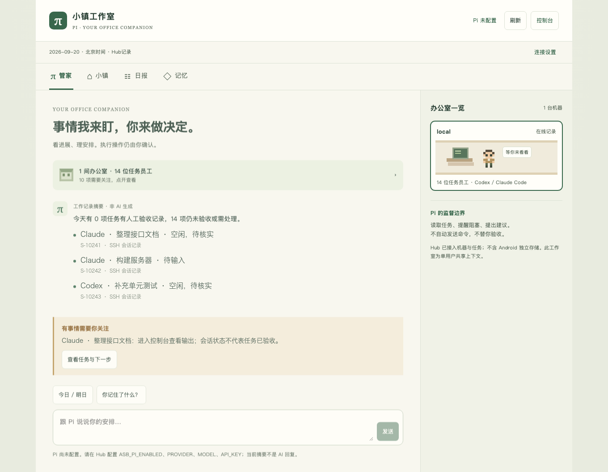
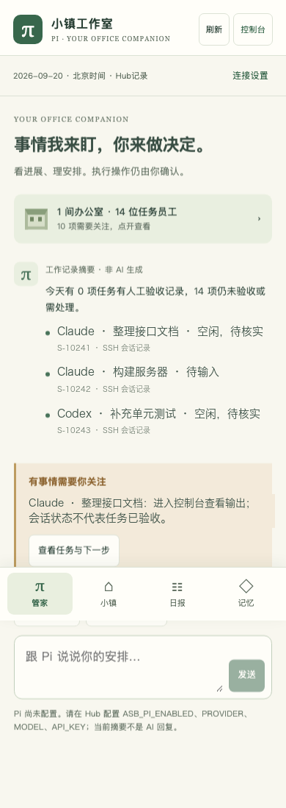
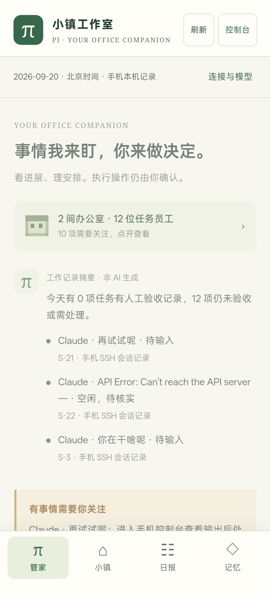
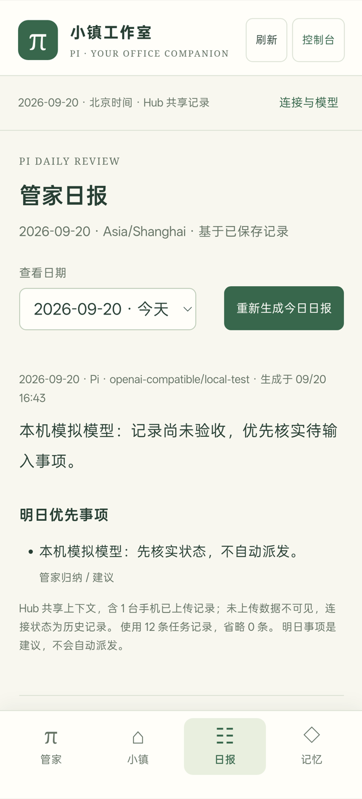

# agentBridge

<p align="center">
  
</p>

agentBridge 是一个自托管的 AI 编程团队控制台。它把本机与远程机器上的 Codex、Claude Code 和 Gemini CLI 会话收拢到一处，用「任务 + 人工验收」管理产出，再用移动端任务规划决定下一步做什么。

会话本身跑在本机 `tmux` 里，会话与消息状态保存在本地 SQLite，不依赖任何托管服务。对远程机器，agentBridge 通过你已有的 SSH 凭据做发现和观察；需要跨网络时用 FRP 打一条安全隧道，而不是把 SSH 端口暴露到公网——这条路径会在你选定的机器上安装 `frpc`（云端入口则安装 `frps`），局域网 SSH 发现本身不装任何东西。

它不替你执行。任务的派发、验收和停止都要人确认；工具不会从「会话空闲」推断任务完成，也不会自动重试投递。

> [!WARNING]
> 本项目可以读取工作区文件、向会话发送输入，并执行经过审批的本机命令。默认只监听 `127.0.0.1`。远程使用时必须配置 API Token、允许的 Host 和工作区目录，并通过受信任的 HTTPS 反向代理或 VPN 接入。

## 三个界面

| 入口 | 位置 | 面向 |
| --- | --- | --- |
| 控制台 | `/` | 操作：会话、任务、审批、机器、终端、公网部署 |
| 小镇工作室 | `/studio` | 日常：管家对话、像素办公室、任务规划、记忆 |
| Android 应用 | [下载 APK](https://otterview-labs.github.io/agentbridge/) | 移动：直连 SSH 机器与 OpenAI 格式模型 |

此外还有 CLI、HTTP API 和飞书三个程序化入口。浏览器工作室与控制台共用同一个 Hub；Android 手机控制器不再依赖 Hub，模型、对话、记忆和任务规划都保存在手机本机。

## 功能

### 会话

- 按工作区创建、切换、重命名和停止会话
- 使用 `tmux` 保持会话持续运行
- 支持 Codex、Claude Code 和 Gemini CLI
- 保存会话消息、状态与巡检结果
- 浏览工作区文件，查看 `git status` 和 `git diff`
- 对停止会话和高风险终端命令执行审批

### 任务与指挥中心

- 指挥中心分开展示机器、已检测 AI 工具、执行实例、任务与待处理事项
- 本机任务支持明确目标、人工下发、规则观察、提交证据与人工验收
- 任务和时间线保存在 SQLite；远程 Runner 尚未实现，不会将远程登记显示为可执行

任务流程、监督边界及 API 见 [`docs/command-center.md`](docs/command-center.md)。

### 远程机器与公网中转

- 通过 SSH 发现本机以外的 Mac/Linux 机器，读取已安装的 AI CLI、`tmux` 窗格和已有的 Claude/Codex 会话记录
- 把远端 Claude/Codex/Gemini 窗格导入为可观察的任务，抓取有界输出、发送输入，并把输入记录整理成问答时间线
- 用 FRP STCP 隧道接入内网机器，而不是为其开放 SSH 端口
- 可复用已有的 `frps`，也可托管安装一个；`frpc` 校验 SHA-256 后安装

SSH 机器发现与 FRP 公网中转见 [`docs/frp-relay.md`](docs/frp-relay.md)。

### 小镇工作室

- `/studio` 响应式工作室：管家对话、像素办公室、任务规划与显式记忆
- 任务规划由 Pi 分析生成：先给出验收 / 推进 / 阻塞 / 建议的数量，再为每个事项写一句「在哪个项目里做什么、如何判断完成」
- 模型提供商、地址与密钥在页面内配置，密钥以 AES-256-GCM 加密存储
- 管家支持语音输入；手机没有系统识别器时把短录音上传到 Hub，由本地 `whisper-cli` 转写，转写完即删、不发往第三方云
- Android 应用复用同一套页面资源

Pi 模型配置方法与数据边界见 [`docs/pi-studio.md`](docs/pi-studio.md)。

### 入口与通知

- 提供 Web UI、CLI、HTTP API 和 SSE 事件流
- 可选飞书长连接、主动通知、浏览器通知和 PWA 安装
- Android 应用是独立的手机控制端：直接经 SSH 发现远程机器上的 Claude/Codex 会话并回复，局域网或直连模式下对方机器不需要安装 Runner；管家模型由手机直连 OpenAI 格式接口，对话、记忆与任务规划保存在手机本机

Android 应用可直接从[下载页](https://otterview-labs.github.io/agentbridge/)取用，无需自行构建；WebView 壳、签名与 APK 构建见 [`docs/android-app.md`](docs/android-app.md)。

### 移动端工作流

- 办公室模型对应机器，员工模型对应 Claude/Codex/Gemini 任务；待输入、手动命名、执行中和空闲任务分层展示
- 发送回复、发现员工、刷新输出和生成任务规划都是后台作业，提交后即可离开当前页面
- 长任务通过 Android 前台服务保活，成功或失败发送系统通知；失败的回复草稿会回到输入框，避免重复输入
- 任务详情区分「我问」「Agent 回复」和系统输出，原始记录折叠保留，方便核对证据
- 当 Codex Desktop 正在占用某个线程时，手机端不抢写锁，而是把消息放入该线程队列，等当前回合结束后继续

### 当前状态

| 功能 | 状态 |
| --- | --- |
| Codex 与本机 `tmux` 会话 | 可用，项目仍处于早期阶段 |
| Claude Code、Gemini CLI | 实验性 |
| Web UI、CLI、HTTP API、SSE | 可用，面向单一可信操作者 |
| 指挥中心任务流 | 可用，仅本机执行 |
| SSH 机器发现与远程任务 | 实验性，只发现和观察，不在远端创建进程 |
| FRP 公网中转 | 实验性，第一版只支持一个云端入口 |
| 小镇工作室与 Pi 任务规划 | 实验性，Pi 默认关闭 |
| 飞书入口 | 实验性，必须配置用户或群聊白名单 |
| 文件浏览、Git 预览、受控终端 | 实验性，高权限功能 |
| Android 应用 | 实验性，当前 0.5.25 |
| 在远程机器上创建会话 | 尚未实现 |
| 外部服务器管理 | 可选集成，需要单独安装兼容项目 |

## 界面预览

<p align="center">
  
</p>

<p align="center">
  
  
  
</p>

<p align="center">
  <sub>左起：手机浏览器、Android 应用的本机记录与任务规划。</sub>
</p>

以上为 `/studio`（小镇工作室）：管家对话、像素办公室、任务规划与显式记忆。桌面与手机浏览器共用同一套页面；Android 原生控制器使用独立的手机界面和本机数据。
控制台式管理界面（会话、审批、机器与终端）在 `/`。

## Pi 小镇工作室

新增 `/studio`：响应式 Web / 手机工作室，包含管家对话、像素办公室、
Pi 分析生成的任务规划和显式用户记忆。Android 原生控制器使用独立的手机界面，
直接调用 OpenAI 格式模型，并把对话、记忆和任务规划保存在手机应用私有存储。
页面内可配置模型提供商、API 地址和加密保存的密钥，原有控制台仍可进入。
Pi 默认关闭，配置方法与数据边界见
[Pi 工作室说明](docs/pi-studio.md)。

## 环境要求

- Node.js 22 或更高版本
- `tmux`
- 至少安装一个受支持的 Agent CLI：Codex、Claude Code 或 Gemini CLI
- macOS 或 Linux

macOS 可以使用 Homebrew 安装 `tmux`：

```bash
brew install tmux
```

## 快速开始

```bash
git clone https://github.com/otterview-labs/agentbridge.git
cd agentbridge
npm ci
cp .env.example .env
npm run build
npm run start:server
```

服务默认监听 `http://127.0.0.1:8787`。启动后打开：

- `http://127.0.0.1:8787/`
- `http://127.0.0.1:8787/ui`

如果需要更换端口，在 `.env` 中设置：

```bash
ASB_HTTP_PORT=8790
```

默认的 Agent 命令是：

```bash
ASB_CODEX_BIN="codex --no-alt-screen"
ASB_CLAUDE_BIN="claude"
ASB_GEMINI_BIN="gemini"
```

可以在 `.env` 中替换为对应可执行文件的完整路径或命令参数。

## 使用方式

### Web UI

Web UI 可以管理会话、查看输出、浏览工作区、处理审批，以及检查机器和外部服务。

配置了 `ASB_API_TOKEN` 时，在页面的访问配置中输入 Token。Token 只保存在当前页面内存中，不会写入 Web Storage；刷新或关闭页面后需要重新输入。

### CLI

构建后可以直接执行：

```bash
node dist/cli.js /ping
node dist/cli.js /list
node dist/cli.js /new demo /path/to/projects/demo
node dist/cli.js /use demo
node dist/cli.js /ask 检查当前项目状态
node dist/cli.js /tail demo
```

常用命令：

| 命令 | 用途 |
| --- | --- |
| `/ping` | 检查服务状态 |
| `/list`、`/sessions` | 列出会话 |
| `/new <name> <workspace>` | 创建会话 |
| `/use <name>` | 设置当前会话 |
| `/current` | 查看当前会话 |
| `/status [name]` | 查看会话状态 |
| `/inspect [name]` | 检查会话 |
| `/rename <old> <new>` | 重命名会话 |
| `/stop <name>` | 请求停止会话 |
| `/send <name> <prompt>` | 向指定会话发送消息 |
| `/ask <prompt>` | 向当前会话发送消息 |
| `/tail [name]` | 查看最近输出 |
| `/watch`、`/watch run` | 查看或立即执行巡检 |

完整命令说明见 [`docs/commands.md`](docs/commands.md)。

### HTTP API

常用端点包括：

- `GET /health`
- `GET /sessions`
- `GET /sessions/:name`
- `GET /sessions/:name/tail`
- `POST /command`
- `GET /approvals`
- `GET /tasks`、`POST /tasks`
- `GET /machines`、`POST /machines/ssh`、`POST /machines/:id/ssh/discover`
- `GET /ssh/tasks`
- `GET /frp/overview`、`POST /frp/servers`、`POST /frp/relays`
- `GET /studio/state`、`POST /studio/messages`、`GET /studio/reports`
- `GET /supervisor`
- `POST /supervisor/run`
- `GET /events`

本机默认配置下可以直接检查健康状态：

```bash
curl http://127.0.0.1:8787/health
```

配置了 API Token 时，使用 Bearer 鉴权：

```bash
curl http://127.0.0.1:8787/sessions \
  -H "Authorization: Bearer $ASB_API_TOKEN"
```

### 飞书

飞书入口使用长连接，不需要公开 HTTP 回调地址。最小配置示例：

```bash
ASB_FEISHU_ENABLED=true
ASB_FEISHU_APP_ID=cli_xxx
ASB_FEISHU_APP_SECRET=xxx
ASB_FEISHU_ALLOWED_OPEN_IDS=ou_xxx
ASB_FEISHU_ALLOWED_CHAT_IDS=
ASB_FEISHU_REPLY_IN_THREAD=true
```

启用时必须至少填写一项 `ASB_FEISHU_ALLOWED_OPEN_IDS` 或 `ASB_FEISHU_ALLOWED_CHAT_IDS`，否则程序会拒绝启动。

飞书应用需要机器人、长连接事件订阅以及消息接收、发送和回复权限。相关设置请参考飞书开放平台文档：

- [接收消息事件](https://open.feishu.cn/document/uAjLw4CM/ukTMukTMukTM/reference/im-v1/message/events/receive)
- [回复消息](https://open.feishu.cn/document/server-docs/im-v1/message/reply)
- [获取 tenant access token](https://open.feishu.cn/document/server-docs/authentication-management/access-token/tenant_access_token_internal)
- [长连接事件订阅](https://open.feishu.cn/document/server-docs/event-subscription-guide/event-subscription-configure-/request-url-configuration-case)

## 配置

完整示例见 [`.env.example`](.env.example)。

| 配置项 | 说明 |
| --- | --- |
| `ASB_CODEX_BIN` | Codex 启动命令 |
| `ASB_CLAUDE_BIN` | Claude Code 启动命令 |
| `ASB_GEMINI_BIN` | Gemini CLI 启动命令 |
| `ASB_HTTP_HOST` | HTTP 监听地址，默认 `127.0.0.1` |
| `ASB_HTTP_PORT` | HTTP 端口，默认 `8787` |
| `ASB_API_TOKEN` | API Token，最多 4096 个无空格的可见 ASCII 字符；非回环监听时至少 32 字符 |
| `ASB_ALLOWED_HTTP_HOSTS` | 非回环监听允许接受的 Host 列表 |
| `ASB_ALLOWED_WORKSPACE_ROOTS` | 允许创建会话的工作区根目录 |
| `ASB_AUTO_CONFIRM_WORKSPACE_TRUST` | 是否自动确认 Agent 的工作区信任提示，默认关闭 |
| `ASB_DATA_DIR` | 运行数据目录，默认 `./data` |
| `ASB_DB_PATH` | SQLite 数据库路径 |
| `ASB_SUPERVISOR_ENABLED` | 是否启用定时巡检 |
| `ASB_SUPERVISOR_INTERVAL_MS` | 巡检间隔 |
| `ASB_SSH_HOST_KEY_POLICY` | 远程 SSH 主机密钥策略：`accept-new`（默认，首次连接信任、密钥变更拒绝）或 `strict`（只接受 `known_hosts` 中已有的主机） |
| `ASB_FRP_DOWNLOAD_BASE` | FRP 二进制下载源，默认 GitHub releases；每个云端入口可在 Web UI 中单独覆盖 |
| `ASB_FRP_VERSION` | FRP 版本，默认 `0.61.1` |
| `ASB_FRPC_BIN` | 复用已安装的 `frpc`，留空则由服务自行下载 |
| `ASB_FEISHU_ENABLED` | 是否启用飞书入口 |
| `ASB_FEISHU_ALLOWED_OPEN_IDS` | 允许控制服务的飞书用户列表 |
| `ASB_FEISHU_ALLOWED_CHAT_IDS` | 允许控制服务的飞书群聊列表 |
| `ASB_FEISHU_NOTIFY_CHAT_IDS` | 接收审批和失败操作通知的群聊列表 |
| `ASB_PI_ENABLED` | 是否启用 Pi 工作室，默认关闭 |
| `ASB_PI_PROVIDER` | Pi 模型提供商：`anthropic`、`openrouter` 或 `openai-compatible` |
| `ASB_PI_MODEL` | Pi 模型 ID |
| `ASB_PI_API_KEY` | Pi 专用密钥，不要复用其它 CLI 的凭据 |
| `ASB_PI_BASE_URL` | OpenAI 兼容接口的 Base URL |
| `ASB_SERVER_MANAGER_PATH` | 可选服务器管理项目的路径 |

## 安全

- 不要提交 `.env`、数据库、日志、会话输出或访问令牌。
- 保持默认的 `ASB_HTTP_HOST=127.0.0.1`，不要将无鉴权服务直接暴露到公网。
- 绑定非回环地址时，程序强制要求 API Token、Host 白名单和工作区根目录。
- 可以使用 `openssl rand -hex 32` 生成随机 API Token。
- 远程访问请使用受信任的 HTTPS 反向代理或 VPN。
- `ASB_AUTO_CONFIRM_WORKSPACE_TRUST` 默认关闭，只应对完全信任的目录启用。
- `actorId` 是审计标签，不是多租户身份认证机制。
- 终端、文件浏览和服务器管理属于高权限功能。
- 启用 Pi 后会向配置的提供商发送对话、已确认记忆和任务摘要；SSH 密码、私钥、原始终端输出和命令行不会被发送，但任务标题与你自己输入的正文仍可能含敏感信息。详见 [`docs/pi-studio.md`](docs/pi-studio.md)。
- Android 应用不再保存 Hub Token；模型 API Key、SSH 凭据和本机记录存在应用私有 `SharedPreferences` 中，尚未用 Keystore 加密，设备被 root 或备份被导出时不再受保护。
- 安全问题请使用 GitHub 的私密漏洞报告，不要创建公开 Issue。详情见 [`SECURITY.md`](SECURITY.md)。

## 限制

- 当前主要面向单一可信操作者，不提供多租户身份隔离。
- Claude Code 和 Gemini CLI 适配仍处于实验阶段。
- 远程机器上的会话创建尚未实现；SSH 只能发现、观察和发送输入。
- FRP 第一版只支持一个云端入口，且需要 Linux + systemd + root 或免密 sudo。
- Git 预览不会执行仓库配置的 clean filter、external diff 或 hook，只支持元数据位于工作区内部的普通 `.git` 目录。
- Git 预览不包含原生 Git 的 rename detection 和仅文件模式变化。
- Web UI 刷新或关闭后不会保留 API Token。
- 备份 Pi 模型配置需要同时包含数据库与 `dataDir/pi-model.key`，丢失密钥会拒绝解密。
- Android 应用不会为了刷新状态而持续后台轮询；只有用户提交的发现、回复、刷新输出和生成规划作业会使用前台服务。Windows 主机尚不作为一等 SSH 目标支持。

## 项目结构

```text
agentbridge/
├── public/        # Web UI 与 PWA 文件
├── src/           # 应用源码
├── test/          # 自动测试
├── docs/          # 架构、命令和路线文档
├── android/       # Android WebView 壳、SSH 控制端与构建脚本
├── data/          # 本机运行数据；Git 只跟踪 .gitkeep
└── .github/       # CI、安全扫描和仓库维护配置
```

## 开发

```bash
npm ci
npm run check
```

`npm run check` 会依次执行类型检查、自动测试和构建。

## 文档

- [架构说明](docs/architecture.md)
- [命令说明](docs/commands.md)
- [指挥中心](docs/command-center.md)
- [FRP 公网中转](docs/frp-relay.md)
- [Android App](docs/android-app.md)
- [Pi 小镇工作室](docs/pi-studio.md)
- [开发路线](docs/roadmap.md)
- [贡献指南](CONTRIBUTING.md)
- [支持范围](SUPPORT.md)
- [版本记录](CHANGELOG.md)
- [安全策略](SECURITY.md)

## 许可证

[Apache License 2.0](LICENSE)
